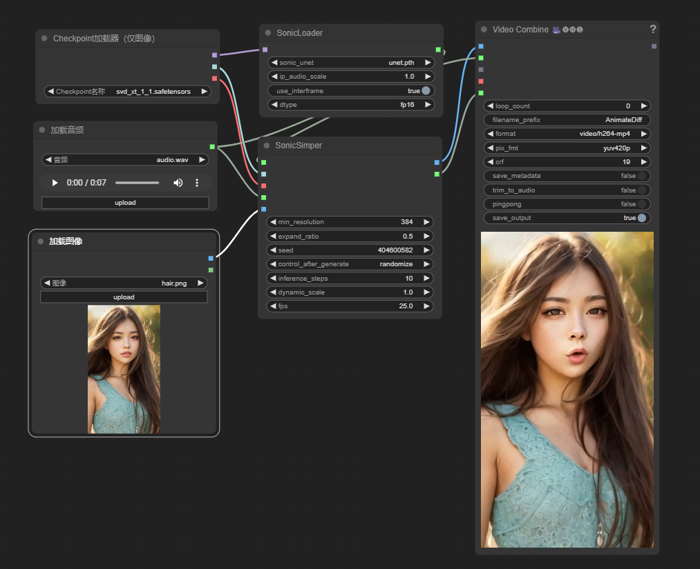
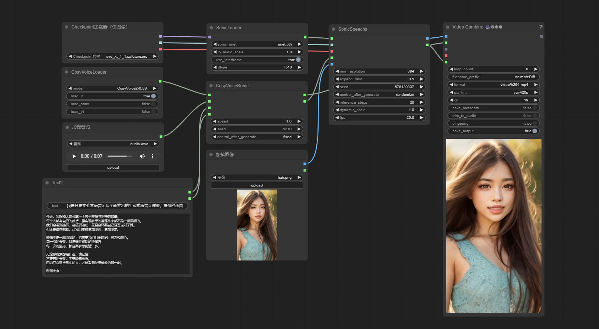
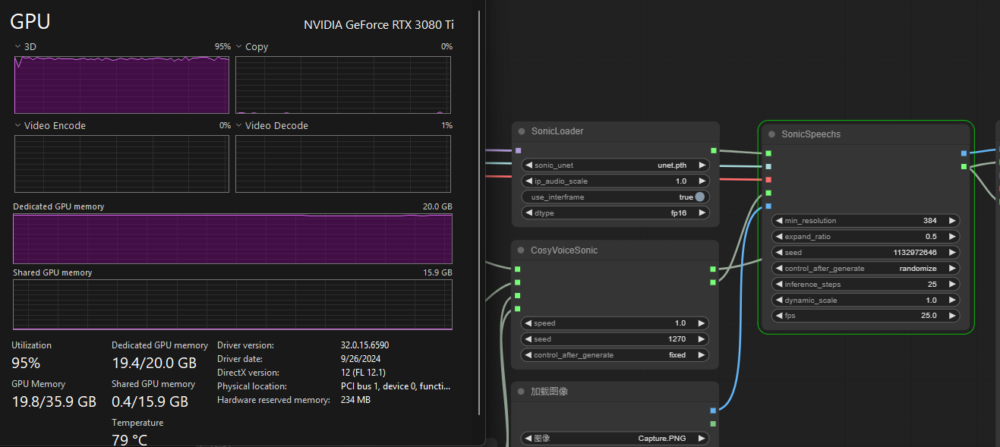

# ComfyUI_Sonic
[Sonic](https://github.com/jixiaozhong/Sonic) is a method about ' Shifting Focus to Global Audio Perception in Portrait Animation',  
You can produce video as long as you want by text with this comfyUI compentent


# Installation

In the ./ComfyUI/custom_node directory, run the following:   
```sh
git clone https://github.com/benda1989/Sonic_ComfyUI.git
cd Sonic_ComfyUI
pip install -r requirements.txt
```

# Model
Download model same as [Sonic](https://github.com/jixiaozhong/Sonic), and file tree looks like this:
```
--  ComfyUI/models/sonic/
    |-- audio2bucket.pth
    |-- audio2token.pth
    |-- unet.pth
    |-- yoloface_v5m.pt
    |-- whisper-tiny/
        |--config.json
        |--model.safetensors
        |--preprocessor_config.json
    |-- RIFE/
        |--flownet.pkl
--  ComfyUI/models/checkpoints
    ├── svd_xt.safetensors  or  svd_xt_1_1.safetensors
```


# Example
## 1 Base usage, audio to video


## 2 Adv usage, text to video

example gpu usage


# Thanks
[Sonic](https://github.com/jixiaozhong/Sonic)   
[ComfyUI_Sonic](https://github.com/smthemex/ComfyUI_Sonic)
